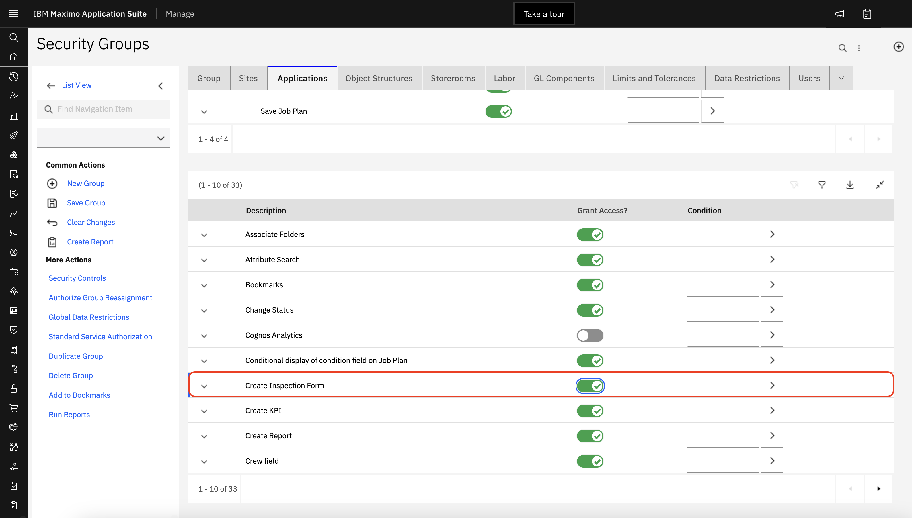
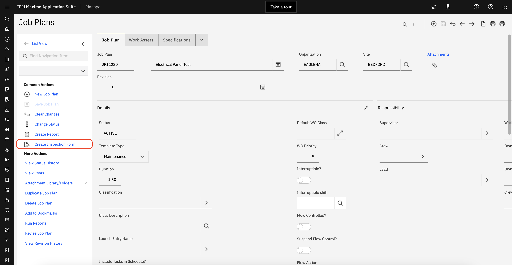
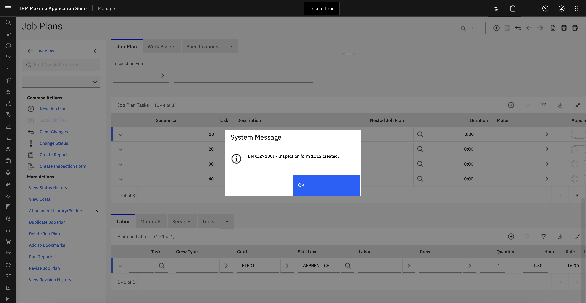
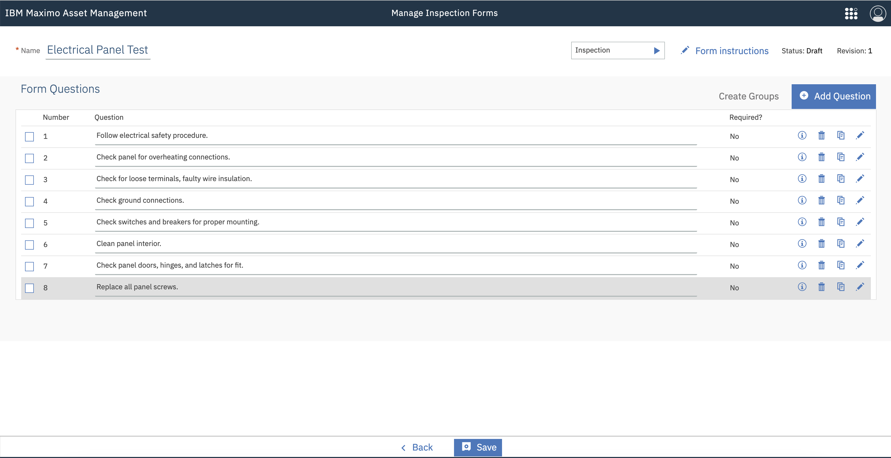
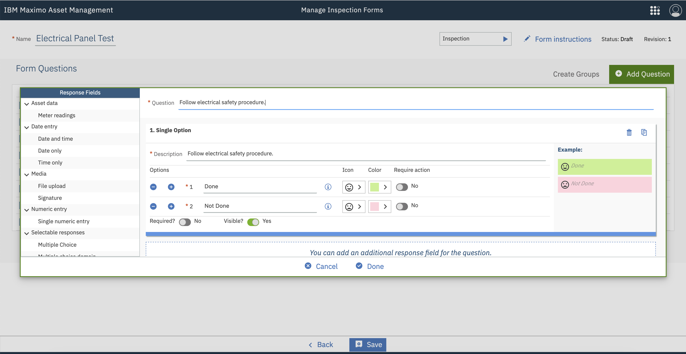

# Introduction
Prior to Inspection Forms, many inspection tasks were modeled as Job Plan tasks, with each inspection item created as a Job Plan task. While this works, in many cases an inspection form is a better option. However, the effort required to migrate the Job Plan tasks to an inspection form can be substantial. 

To reduce the effort required to migrate to inspection forms, this script creates a new inspection form for the selected Job Plan.  Each task is created as a question with a Single Option field containing a positive and negative option. If the task has a meter, a Meter field is added to the question for the meter.

> Documentation for inspection forms can be found here: [https://www.ibm.com/docs/en/maximo-eam-saas?topic=centers-managing-inspection-forms](https://www.ibm.com/docs/en/maximo-eam-saas?topic=centers-managing-inspection-forms)

# Install
The `SHARPTREE.JOBPLAN.FORM` script contains the `scriptConfig` deployment variable used by Sharptree's deployment tools.  If you use our VS Code extension, deploying the script will automatically create the Action Launch Point, Signature Option and Toolbar menu item.

> The VS Code extension and documentation can be found here [https://marketplace.visualstudio.com/items?itemName=sharptree.maximo-script-deploy](https://marketplace.visualstudio.com/items?itemName=sharptree.maximo-script-deploy)

# Usage
There are two ways the script can be used, through the Maximo user interface in the Job Plan application or it can be invoked directly from a web service call.

## Job Plan Application
After deploying the `SHARPTREE.JOBPLAN.FORM` script navigate to the `Security Groups` application, select a group to grant the ability to convert a Job Plan to Inspection Form and search for the `Job Plan` application. Having selected the `Job Plan` application, search for the `Create Inspection Form` security option and grant the option to the selected group.

Navigate to the Job Plans application and select a Job Plan record to create an Inspection Form from. From the tool bar items select the `Create Inspection Form` menu item.

A new Inspection Form is created with an auto generated form number and a description matching the description of the Job Plan. After the Inspection Form is created a dialog displays the Inspection Form number.

For each task an inspection question is created with a Single Option field with a positive and negative option. Nested Job Plans will be flattened and added to the inspection questions. By creating each Job Task as a question it is then easy to organize the questions into logic groupings.

### Script Options
The positive and negative options each have a number of variable that define the resulting configuration of the Single Option options. Below is a table of the options.

|  Variable             | Description                                           | Default Value             |
|:----------------------|:------------------------------------------------------|:--------------------------|
| POSITIVE_COLOR        | The background color for the positive response.       | #C8F08F (green)           |
| POSITIVE_ICON         | The icon displayed for the positive response          | social:mood (smile)       |
| POSITIVE_DESCRIPTION  | The description for the positive response             | Done                      |
| NEGATIVE_COLOR        | The background color for the negative response.       | #FFD2DD (red)             |
| NEGATIVE_ICON         | The icon displayed for the negative response          | social:mood-bad (frown)   |
| NEGATIVE_DESCRIPTION  | The description for the negative response             | Not Done                  |

## Web Service Call
The script can be invoked directly from a web service call. To invoke script log into Maximo and then navigate to `https://[maximo_host]/maximo/oslc/script/sharptree.jobplan.form?jp=[job_plan_number]` where `[maximo_host]` is the host name for your Maximo instance and `[job_plan_number]` is the Job Plan number to convert. The script returns a JSON object with the status of either `success` or `error`, a description and the form number if successful.

### Query Parameters
A Job Plan number is required and is provided with the `jp` query parameter.  Additional query parameters are available as described in the table below.

|  Query Param          | Description                                           | Default Value             |
|:----------------------|:------------------------------------------------------|:--------------------------|
| jp                    | The Job Plan number.                                  |                           |
| pc                    | The background color for the positive response.       | #C8F08F (green)           |
| pi                    | The icon displayed for the positive response          | social:mood (smile)       |
| pd                    | The description for the positive response             | Done                      |
| nc                    | The background color for the negative response.       | #FFD2DD (red)             |
| ni                    | The icon displayed for the negative response          | social:mood-bad (frown)   |
| nd                    | The description for the negative response             | Not Done                  |