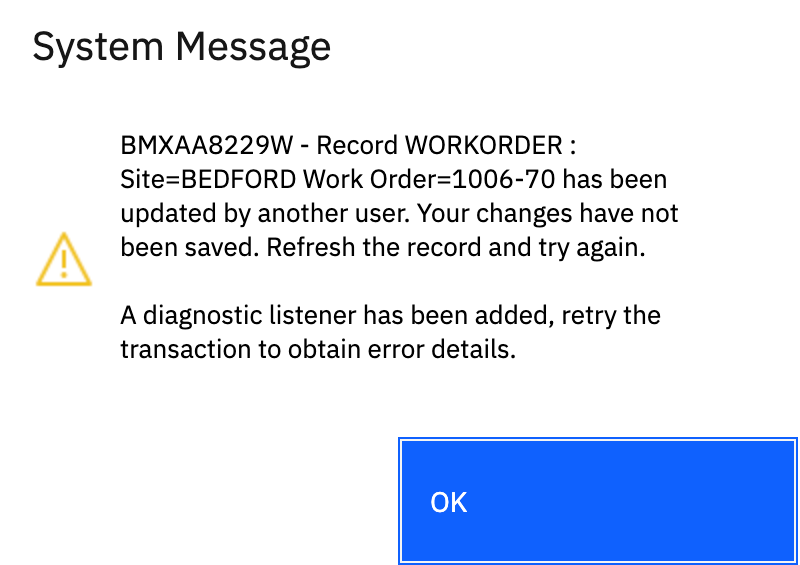
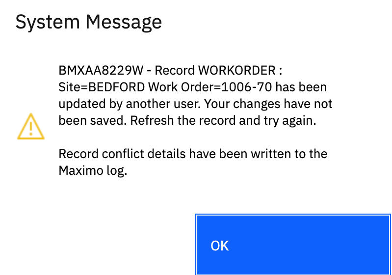

# Introduction
Maximo performs optimistic locking, allowing another user to update a record concurrently with another user. When this occurs the second user to save the record will receive the following error: 

```
BMXAA8229W - Record {OBJECTNAME} : {RECORDID} has been updated by another user. Your changes have not been saved. Refresh the record and try again." 
```

While this is a legitimate error when two users are interacting through the web interface, it can also be caused by programming errors where the same record is updated through to different relationships, triggering the same concurrency problem. This often happens in systems with a large number of automation scripts acting on the same object.

Tracking down which relationships are being used and which script is triggering the error can be extremely difficult and time consuming. This script automates the troubleshooting process and provides a clear listing of each Mbo, relationships and values updated. It utilizes the ability to trigger an automation script on error to set up a diagnostic listener and then capture the error details when the error occurs again.


# Deploying
To deploy the script and ensure the script is named `MXERR.SYSTEM.ROWUPDATEEXINFO`, that is all that is required.

There is an variable named `email` near the top of the script. Setting this variable to an email address will cause the script to email the diagnostic results to the email address.

> Note: The diagnostic script can be quite memory intensive, it should be used for troubleshooting purposes only and should be removed once troubleshooting is completed.


# Usage
Using the script just requires that a user trigger the error, which will display the following error, note the added details indicating a listener has been added.



Trigger the error again and the following message will be displayed.



Diagnostic details are written to the log and optionally emailed to the address specified in the email variable.

## Example Output

The following output the `WORKORDER` object was updated through the `CHILDTASK`, `$MYMBO`  and `WOACTIVITY` relationships with the `DESCRIPTION` attribute updated through each of these relationships. With this information a developer can search automation scripts and customizations to locate where these relationships are used and where the modified values may be set. 

```json
[
    {
        "objectName": "WORKORDER",
        "objectDetails1": {
            "recordId": "WORKORDER :  Site=BEDFORD Work Order=1006-70",
            "relationship": "CHILDTASK",
            "parent": "WORKORDER",
            "child": "WORKORDER",
            "modifiedAttributes": [
                "DESCRIPTION = Update 2",
                "CHANGEBY = MAXADMIN",
                "CHANGEDATE = 7/17/23 10:38 PM",
                "ESTLABCOST = 0.00",
                "JPASSETS = Y",
                "WOGROUP = 1006",
                "JPINCLUDECLASSLESS = Y"
            ]
        },
        "objectDetails2": {
            "recordId": "WORKORDER :  Site=BEDFORD Work Order=1006-70",
            "relationship": "$MYMBO",
            "parent": "WORKORDER",
            "child": "WORKORDER",
            "modifiedAttributes": [
                "DESCRIPTION = Update 3",
                "CHANGEBY = MAXADMIN",
                "CHANGEDATE = 7/17/23 10:38 PM",
                "ESTLABCOST = 0.00",
                "JPASSETS = Y",
                "WOGROUP = 1006",
                "JPINCLUDECLASSLESS = Y"
            ]
        },
        "objectDetails3": {
            "recordId": "WOACTIVITY :  Site=BEDFORD Activity=1006-10",
            "relationship": "WOACTIVITY",
            "parent": "WORKORDER",
            "child": "WOACTIVITY",
            "modifiedAttributes": [
                "DESCRIPTION = Update 1",
                "CHANGEBY = MAXADMIN",
                "CHANGEDATE = 7/17/23 10:38 PM",
                "ESTLABCOST = 0.00",
                "JPASSETS = Y",
                "WOGROUP = 1006",
                "JPINCLUDECLASSLESS = Y"
            ]
        }
    }
]
```